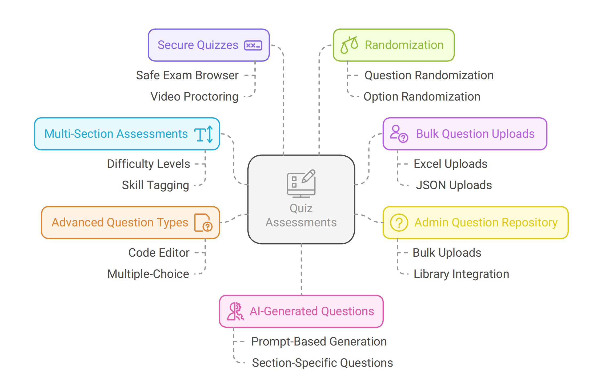
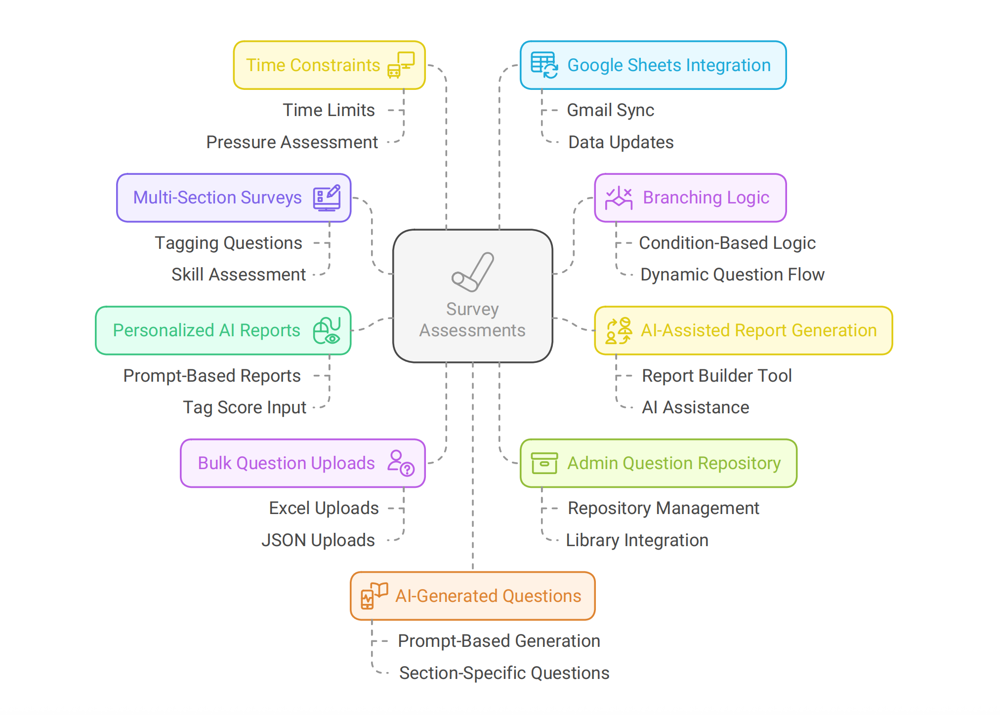

# 🛠️ Turiyaskills Assessment Platform Features

Welcome to the Turiyaskills assessment platform! This guide walks you through powerful features available in SMARTEVAL (quiz-based assessments) and ASSESS360 (survey-based assessments). Learn how to build secure, AI-powered assessments and generate insightful reports effortlessly.

## 📘 SMARTEVAL: Quiz Assessments

### 1. Multi-Section Assessments
Design quizzes with multiple sections (skills or topics). Tag each question by difficulty level—Easy, Medium, or Complex—to ensure balanced assessments.

### 2. Bulk Question Uploads
Easily upload questions using Excel or JSON templates. You can also import questions from your existing assessment library.

### 3. Admin Question Repository
As an admin, upload bulk questions directly into the central repository from the Admin Settings. This enables team-wide reuse and consistency across assessments.

### 4. Advanced Question Types
Use enriched question formats like Multiple Choice with Code Editor. Add code snippets and ask users to choose the most suitable answer.

### 5. Secure Quizzes with Safe Exam Browser (SEB)
Ensure a cheat-proof exam by enabling SEB. The system can also capture and record participant photos during the test for added security.

### 6. Video Proctoring
Combine SEB with video proctoring to monitor candidates in real-time. After completion, receive an AI-generated proctoring report along with the quiz result.

### 7. Randomization
Enable randomization of questions and multiple-choice options to prevent sharing of answers and maintain assessment fairness.

### 8. AI-Generated Questions
Save time using our AI-powered question generator. Just input a prompt and generate relevant questions for each quiz section.

## 📗 ASSESS360: Survey Assessments

### 1. Multi-Section Surveys
Build surveys across multiple sections or topics. Tag questions and options to compute scores via the rule engine, enabling rich analytics.

### 2. Branching Logic
Use conditional logic to show or hide specific questions based on prior answers, enabling personalized and adaptive surveys.

### 3. AI-Assisted Report Generation
Quickly generate structured reports using our Report Builder, enhanced with AI for deeper insights.

### 4. Personalized AI Reports
Get fully customized reports by feeding tag scores, questions, and responses into our AI engine. Provide a prompt to generate unique, user-specific feedback.

### 5. Bulk Question Uploads
Upload survey questions in bulk using Excel or JSON formats, or import from the question library to reuse existing content.

### 6. Admin Question Repository
Admins can manage a shared question repository via the Admin Settings, making it easier to organize and reuse questions.

### 7. Time Constraints
Set timed sections or assessments to simulate real-world pressure scenarios and evaluate decision-making under deadlines.

### 8. Google Sheets Integration
Connect your Gmail account to sync survey responses and scores directly to Google Sheets, enabling real-time tracking and analysis.

### 9. AI-Generated Questions
Create questions for each section using our AI Question Generator. Input your context or prompt to instantly get relevant survey items.

## Key Benefits

### 🔒 Security Features
- Safe Exam Browser (SEB) integration
- Video proctoring capabilities
- Real-time monitoring and alerts
- AI-powered malpractice detection

### 🤖 AI-Powered Capabilities
- Automated question generation
- Intelligent report creation
- Personalized feedback systems
- Advanced analytics and insights

### 📊 Analytics & Reporting
- Comprehensive performance metrics
- Custom report generation
- Real-time data synchronization
- Tag-based scoring systems

### 🔄 Integration Options
- Google Sheets connectivity
- Bulk import/export capabilities
- Admin repository management
- Cross-platform compatibility

## Getting Started

1. **Choose Assessment Type**: Select between SMARTEVAL (quizzes) or ASSESS360 (surveys)
2. **Design Structure**: Create multi-section assessments with appropriate difficulty levels
3. **Add Content**: Use bulk uploads, imports, or AI generation for questions
4. **Configure Security**: Enable SEB and video proctoring as needed
5. **Deploy & Monitor**: Launch assessments and track performance in real-time

## Need Help?

If you're stuck or need more details on how to use these features, please visit our Support Center or contact your platform administrator.

For comprehensive guides on specific features, explore our documentation sections:
- [SMARTEVAL & ASSESS360 Guide](/features/smarteval-assess360)
- [Question Bank Management](/features/question-bank)
- [Analytics & Reporting](/features/analytics)
