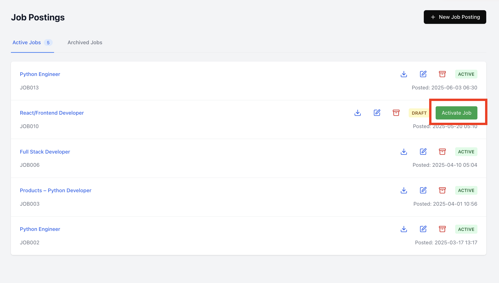

Here's a step-by-step documentation for the **Top1 Talent Pipeline Workflow** in the **Turiyaskills** app.

---

# **Top1 Talent Pipeline Workflow - Step-by-Step Guide**

## **1. Creating a New Job and Uploading Job Description (JD)**

- Navigate to the **Job Creation** page in the Top1 module.
- Click on **"Create New Job"** to initiate the process.
- Upload the **Job Description (JD)** file (PDFformat).
- The **AI Parser Engine** processes the uploaded JD and extracts relevant details such as:
  - **Job Title**
  - **Job Description**
  - **Required Skills**
  - **Experience Level**
  - **Location**
  - **Industry & Domain**
  - **Preferred Qualifications**
- The extracted data is automatically populated into the **Job Table**.
- The frontend UI updates dynamically with the refreshed job data.
- The system also suggests **appropriate job posting channels** based on:
  - **Extracted job title, skills, and description.**
  - **Historical hiring trends and candidate sourcing insights.**
- The user reviews the extracted information and modifies if necessary.
- Click **"Save Job Details"** to finalize the job creation and **"Activate"** the Job in the Jobs Listing page

---

## **2. Parsing and Matching Resumes Against the JD**

- Navigate to the **Resume Parsing** section.
- Select the **recently created job** from the job list.
- Upload multiple resumes in bulk (PDF format).
- The **AI Resume Parser Engine** processes resumes to:
  - Extract candidate details (Name, Contact, Experience, Skills, Education, etc.).
  - Match each resume with the **JD details**.
  - Score each candidate based on the **match percentage**.
- Candidates are filtered based on a predefined **threshold score**.
- Users can:
  - **Shortlist** candidates who meet the criteria.
  - **Reject** candidates below the threshold.

---

## **3. Tagging SMARTEVAL Assessments for Qualified Candidates**

- Choose an appropriate assessment relevant to the job role.
- Tag the shortlisted candidates to the **SMARTEVAL assessment**.
- The system updates the **Distribution List** with selected candidates for the corresponding SMARTEVAL Assessment.
- Click **"Proceed to Publish"** to configure assessment settings.

---

## **4. Publishing the Assessment to Shortlisted Candidates**

- Configure assessment settings such as:
  - **Enable/Disable Proctoring** for remote monitoring.
  - **Number of Attempts Allowed**.
  - **Assessment Link Expiry Date**.
- The system auto-generates an assessment link for each candidate.
- Click **"Send Assessment Invitations"** to email the assessment links to candidates.

---

## **5. Candidate Assessment Completion & Analytics Review**

- Candidates receive an email with a unique assessment link.
- They complete the test as per the configured settings.
- The system updates the **Assessment Response Status**.
- Navigate to the **Analytics Section** to review:
  - **Candidate Scores**
  - **Assessment Status (Completed/Pending)**
  - **Skills Gap Analysis**
- Use insights to make **final hiring decisions**.

---

This workflow ensures an **AI-driven, automated, and efficient** talent pipeline to filter, assess, and hire top candidates seamlessly. 🚀