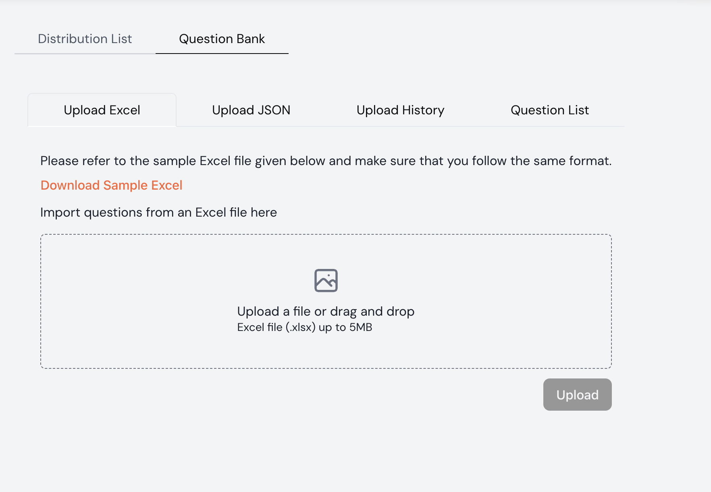
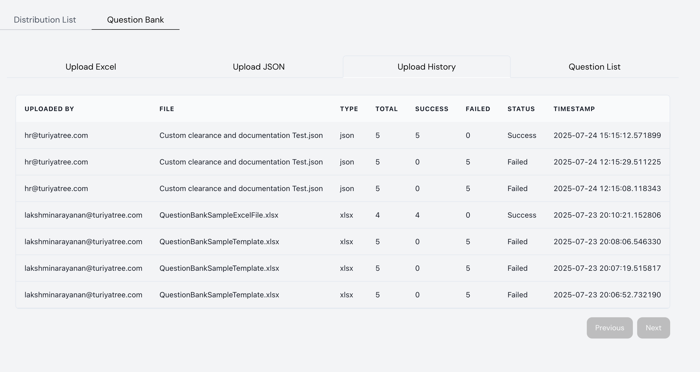
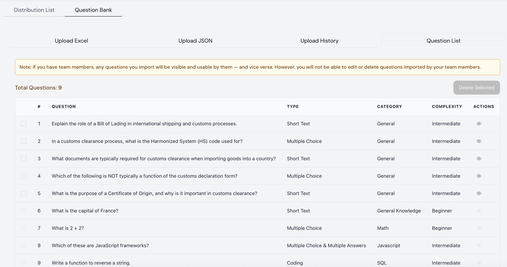
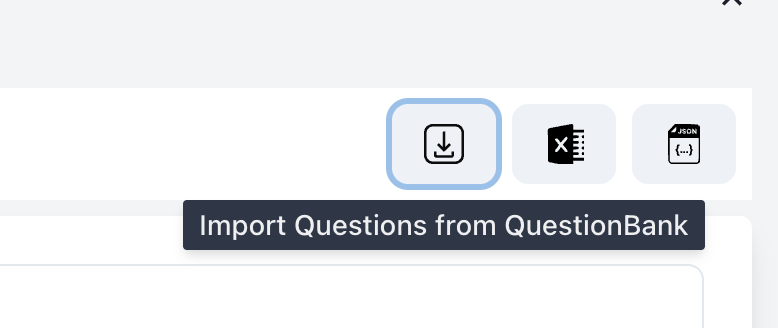
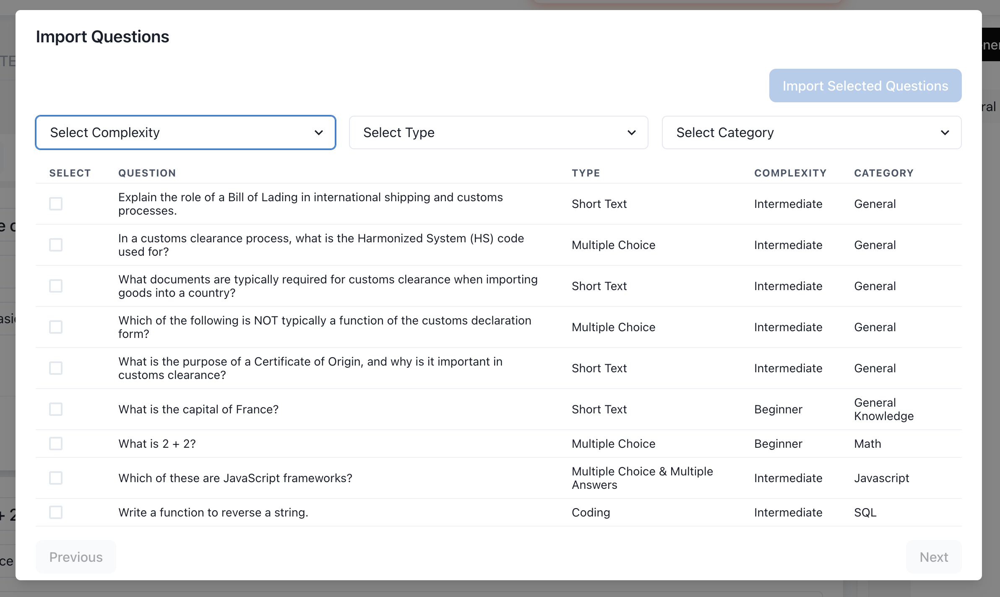

# Question Bank Management

Here are the detailed steps to upload questions, manage the Question Bank, and import questions into the assessment editor in Turiyaskills.

## ✅ Step 1: Upload Questions to the Question Bank

1. Navigate to the **Question Bank** tab
2. Choose the **Upload Excel** or **Upload JSON** option
3. Download the sample Excel format via the "Download Sample Excel" link if needed
4. Drag and drop or browse and select your `.xlsx` file (max 5MB)
5. Click the **Upload** button to initiate the upload process

### Supported Formats:
- **Excel (.xlsx)** - Maximum file size: 5MB
- **JSON** - Structured question data format

## ✅ Step 2: Verify Upload Status

1. Click on the **Upload History** tab to view the status of uploads
2. The table displays:
   - **File name**
   - **Uploaded by**
   - **File type** (xlsx or json)
   - **Total questions** attempted
   - **Success and failure** counts
   - **Upload status** (Success/Failed)
   - **Timestamp**

This helps you track all upload activities and identify any issues with question imports.

## ✅ Step 3: View All Uploaded Questions

1. Go to the **Question List** tab
2. All uploaded questions will be visible here regardless of the source (Excel/JSON)
3. The list includes:
   - **Question** text
   - **Type** (Short Text, MCQ, Coding, etc.)
   - **Category**
   - **Complexity** level

### Team Collaboration Features:
- ⚠️ **Note**: If you have team members, questions imported by them will be visible and usable by you — and vice versa
- 🔒 **Permissions**: You will only be able to edit or delete questions imported by you

## ✅ Step 4: Import Questions in Assessment Editor

1. While creating or editing an assessment, click the **Import Questions from QuestionBank** icon (⭳)
2. A modal will open with filter options:
   - **Complexity** level
   - **Question Type**
   - **Category**

This allows you to quickly find and reuse questions from your existing question bank.

## ✅ Step 5: Select & Import Questions

1. Use filters to refine question selection based on your assessment needs
2. Tick checkboxes next to questions you want to import
3. Click the **Import Selected Questions** button (top-right) to add them to the current assessment

### Selection Tips:
- Use multiple filters to narrow down relevant questions
- Preview questions before importing
- Select questions that match your assessment's complexity level
- Ensure question types align with your evaluation goals

## Question Types Supported

- **Multiple Choice Questions (MCQ)** - Single or multiple correct answers
- **Short Text** - Brief written responses
- **Long Text** - Extended written responses
- **Coding Questions** - Programming challenges
- **True/False** - Binary choice questions
- **Fill in the Blanks** - Complete the missing information

## Best Practices

### 📝 Question Creation
- Use clear, concise language
- Ensure questions align with learning objectives
- Include appropriate difficulty levels
- Add relevant categories for easy filtering

### 📊 Organization
- Categorize questions by subject or skill area
- Use consistent complexity ratings
- Maintain a balanced mix of question types
- Regular review and update of question bank

### 👥 Team Management
- Establish naming conventions for uploaded files
- Regular cleanup of outdated questions
- Share best practices for question creation
- Monitor upload history for quality control

## Troubleshooting

### Common Upload Issues:
- **File size exceeds 5MB**: Compress or split the file
- **Invalid format**: Ensure Excel file follows the sample template
- **Missing required fields**: Check that all mandatory columns are filled
- **Duplicate questions**: Review existing questions before upload

### Import Issues:
- **Questions not appearing**: Check category and complexity filters
- **Cannot edit questions**: Verify you have ownership permissions
- **Import failed**: Ensure assessment editor is in edit mode

For additional support with Question Bank management, please contact our support team.
