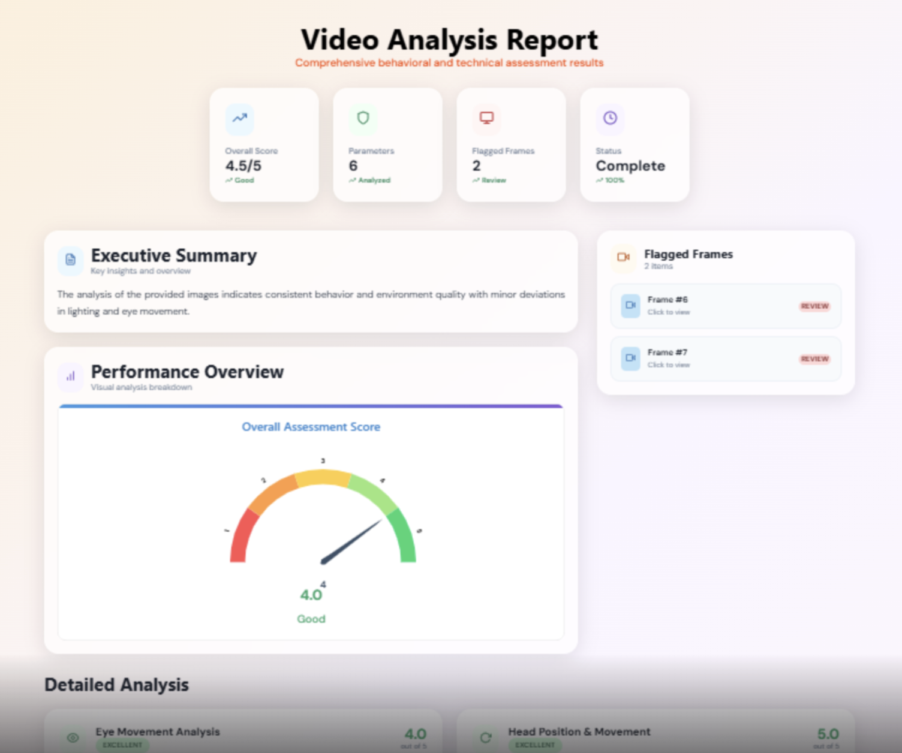
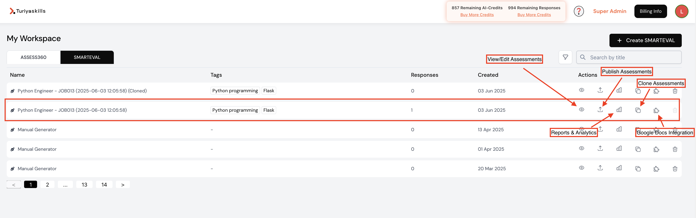
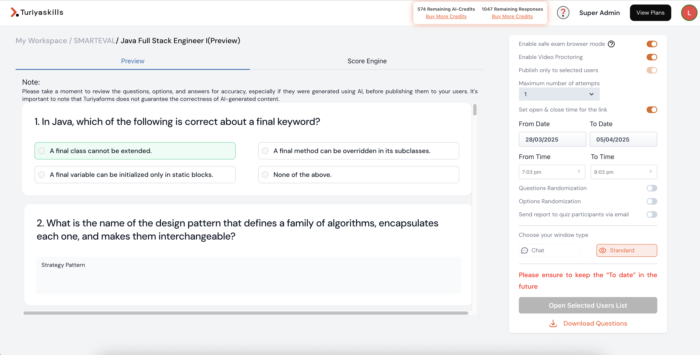
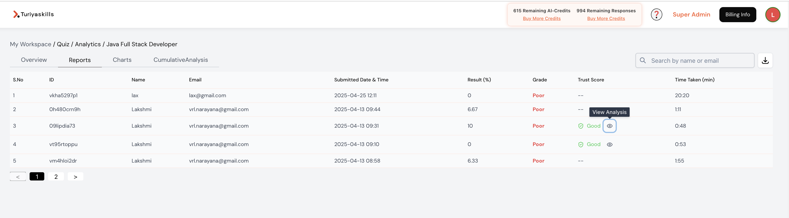

# Creating and Publishing SMARTEVAL (Tests), and ASSESS360 (Evaluation, Surveys)

![SMARTEVAL ### Tab Switching:** Detects if the test-taker is switching between different browser tabs.

### Assessment Access Control
**Enhanced security measures** have been implemented to prevent assessment tampering:

- **Single Session Enforcement:** Users in a published list are now prevented from opening the same assessment in multiple tabs or sessions simultaneously
- **Session Management:** Ensures assessment integrity by maintaining single-point access control
- **Duplicate Prevention:** Eliminates potential for multiple concurrent assessment attempts

### Alerts and Reporting
The system generates alerts and reports based on the AI-powered malpractice detection. These reports can be reviewed by administrators to identify potential instances of cheating.

SESS360 Platform](./SMARTEVAL_ASSESS360.png)

This document outlines the process of creating, publishing, and analyzing evaluations, tests, and surveys within our system. It covers key features such as test creation with time limits, survey design with diverse question types, proctoring and malpractice detection, email template customization, reporting and analytics, question generation, and cloning capabilities. This comprehensive guide aims to provide a clear understanding of how to effectively utilize the system for assessment and data collection purposes.

## Evaluation and Surveys (Assess 360)

The system also supports the creation and distribution of evaluations and surveys, often referred to as "Access 360." These surveys are designed to gather specific information from candidates or employees.

### Survey Creation Interface
Navigate to the "Surveys" or "Access 360" section. Click on "Create New Survey" to begin.

### Survey Details
Provide a name and description for the survey. Clearly define the purpose of the survey to guide the selection of appropriate questions.

### Question Types
The system supports a variety of question types, including:

- **Text Input:** For open-ended responses.
- **Multiple Choice:** With single or multiple selections.
- **Dropdown:** For selecting from a predefined list of options.
- **Rating Scales:** For assessing opinions or satisfaction levels.
- **Yes/No:** For collecting binary response

### Example Questions
Common questions used in surveys include:

- Expected Salary
- Preferred Location
- Skills and Experience
- Feedback on a specific topic

### Response Collection
Once the survey is published, the system provides a unique link that can be shared with the target audience. Responses are automatically collected and stored within the system.

## Creating SMARTEVAL (Tests)

The system allows for the creation of various types of tests, primarily focusing on multiple-choice questions. Here's a breakdown of the process:

### Test Creation Interface
Navigate to the "SMARTEVAL" tab within the platform. Click on the "Create SMARTEVAL" button to initiate the test creation process.

### Test Details
Provide essential details such as the test name, description, and instructions for the test-takers.

### Question Addition
Add questions to the test. The system supports multiple-choice questions with single or multiple correct answers. You can manually input questions or import them from a pre-existing question bank (if available).

#### Judge0 Compiler Integration
The **Judge0 compiler** has been integrated into the front-end candidate assessment pages, providing:

- **Real-time code compilation** and execution within the assessment environment
- **Support for coding questions** with immediate feedback
- **Multi-language support** for various programming languages
- **Interactive coding environment** available in both chat and standard windows
- **Automated code evaluation** for technical assessments

### Answer Options
For each question, provide the answer options and designate the correct answer(s).

### Time Limits
Set a time limit for the test. This feature is crucial for ensuring fair and standardized assessments. The time limit can be specified in minutes.

### Publishing
Once the test is complete and reviewed, publish it to make it available to the intended audience. You can specify the start and end dates for the test's availability.

#### Admin Assessment Notifications
A **"Get notified on assessment completion"** flip switch button has been added to the **SMARTEVAL Quiz Publish area**. This feature will automatically send an email notification to the administrator/owner of the assessment once a candidate/user completes their assessment, ensuring real-time awareness of assessment progress.

## Offline Assessment Submission

The system now includes **offline assessment submission** capabilities to ensure data integrity during internet connectivity issues.

### Local Data Storage
The system temporarily saves assessment data locally if internet connectivity is lost, ensuring that user submissions are not lost and can be processed once the connection is restored. This feature provides:

- **Automatic backup** of candidate responses during network interruptions
- **Seamless recovery** when internet connection is restored
- **Data integrity protection** preventing loss of assessment progress
- **Continuous assessment experience** without interruption for candidates

## Proctoring and Malpractice Detection for Tests

To ensure the integrity of SMARTEVAL tests, the system incorporates proctoring and malpractice detection features.

### Safe Exam Browser Mode
This mode restricts access to other applications and websites during the test, preventing test-takers from cheating.

### Student Photo Capture
The system captures student photos at regular intervals (e.g., every few seconds) during the test. This provides a visual record of the test-taker's behavior.

### AI-Powered Malpractice Detection
The system utilizes AI algorithms to detect potential malpractice based on five key parameters:

- **Eye Movement:** Detects if the test-taker is looking away from the screen excessively.
- **Head Movement:** Detects unusual head movements that might indicate cheating.
- **Object Detection:** Detects the presence of unauthorized objects (e.g., mobile phones) in the test-taker's environment.
- **Person Detection:** Detects the presence of other people in the test-taker's environment.
- **Tab Switching:** Detects if the test-taker is switching between different browser tabs.

### Alerts and Reporting
The system generates alerts and reports based on the AI-powered malpractice detection. These reports can be reviewed by administrators to identify potential instances of cheating.

## Email Templates

Customizable email templates are available for sending invitations to tests and surveys.

### Template Customization
The system allows you to customize the content of email invitations, including the subject line, body text, and branding elements.

### Personalization
You can personalize email invitations by including the recipient's name and other relevant information.

### Automated Sending
The system can automatically send email invitations to a list of recipients.

### Updated Email Templates
The **standard email template** has been updated with:

- **New design** with improved visual appeal and professional appearance
- **Enhanced content** for better communication clarity
- **Improved user experience** with clearer call-to-action elements
- **Better mobile compatibility** for various email clients

## Reporting and Analytics

The system provides comprehensive reporting and analytics capabilities for analyzing survey responses and test results.

### Survey/Test Views
Generate reports that display no of views, including:

- **Candidate views:** Candidate's views, submissions and average time of completion

### Survey/Test Response Reports
Generate reports that display survey responses, including:

- **Candidate data:** Data collected from each candidate
- **Candidate performance analysis:** AI evaluation score, explanation, grades, skill gap analysis etc

### Charts and Graphs
Visualize survey responses using various charts and graphs, such as:

- **User Responses:** User responses per day and per hour distribution.

### Enhanced PDF Report Generation
The **backend logic** for generating and downloading PDF reports has been significantly modified for:

- **Better performance** with faster report generation times
- **Improved reliability** with enhanced error handling
- **Optimized file processing** for larger datasets
- **Enhanced formatting** for professional report presentation

## SMARTEVAL Tests Generation from Job Description

A feature that will automatically generate questions based on job descriptions and required skills. This feature is well explained in **"How to create skill assessments from JD?"**

### Job Description Input
The user will input a job description into the system.

### Skill Identification
The system will automatically identify the key skills and requirements from the job description.

### Question Generation
The system will generate relevant questions based on the identified skills and requirements.

### Improved Assessment Generation Complexity
Recent improvements have been made to address **question complexity issues**:

- **Enhanced guidelines** for generating appropriately complex questions
- **Improved AI prompts** to ensure proper difficulty levels
- **Better question variety** with appropriate complexity distribution
- **Quality assurance** for generated assessment content

## Cloning

The system allows you to clone existing evaluations or surveys to create new ones quickly.

### Cloning Process
Select the test, evaluation or survey you want to clone. Click on the "Clone" or "Duplicate" button.

### New Evaluation/Survey
The system will create a copy of the selected evaluation or survey. You can then modify the copy as needed.

This cloning feature saves time and effort by allowing you to reuse existing content and structures.
