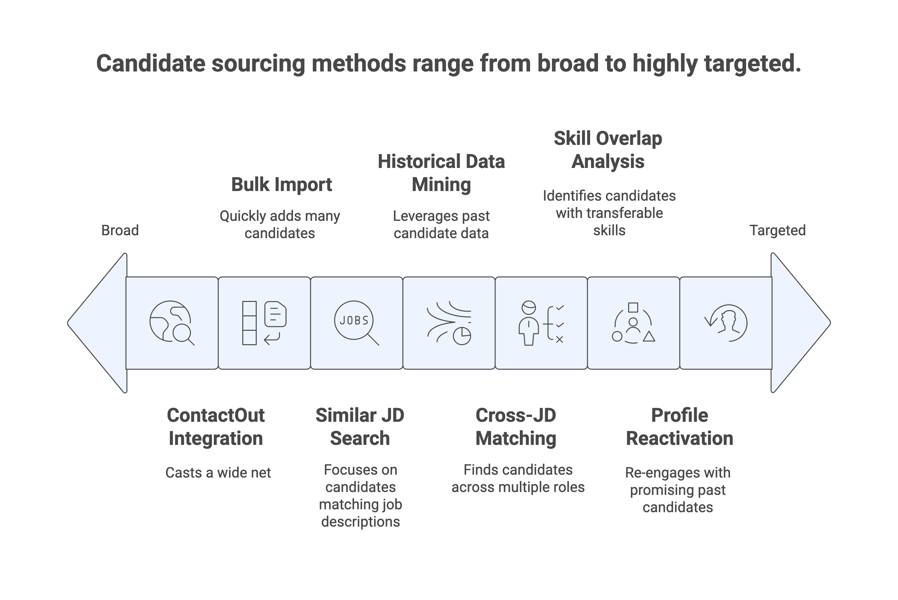
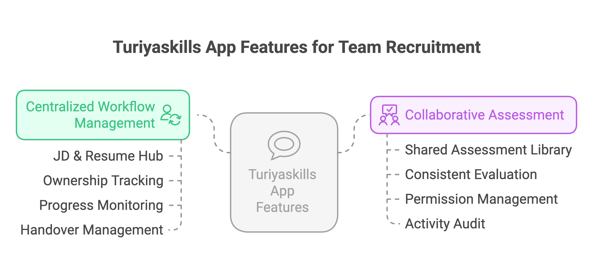

# 🎯 Turiyaskills Top1 App Features

Welcome to the Top1 App - your comprehensive recruitment automation platform! This guide walks you through powerful features designed to streamline hiring workflows from job description analysis to candidate evaluation and insights generation.

## 📄 Job Description (JD) Processing & Analysis

### 1. JD Upload & Parsing
Upload job descriptions in various formats and let our AI automatically extract key requirements, skills, and qualifications needed for the role.

### 2. Skill Extraction & Clustering
- **Automatic Skill Identification**: AI identifies required and preferred skills from job descriptions
- **Skill Clustering**: Groups related skills for better assessment organization
- **Complexity Mapping**: Assigns difficulty levels to different skill requirements
- **Role Alignment**: Ensures assessments match specific job requirements

### 3. JD-Based Assessment Creation
- **Automated Quiz Generation**: Create role-specific assessments directly from job descriptions
- **Multi-Section Structure**: Organize assessments by skill categories (max 5 sections)
- **Question Complexity**: Generate questions at appropriate difficulty levels
- **Customization Options**: Fine-tune question types and assessment parameters

*[Learn more about JD & Resume Parsing →](/features/jd-resume-parsing)*

## 📝 Resume Processing & Management

### 1. Resume Upload & Parsing
- **Bulk Resume Processing**: Upload and parse multiple resumes simultaneously
- **Data Extraction**: Automatically extract candidate information, skills, and experience
- **Format Support**: Process various resume formats (PDF, DOC, DOCX)
- **Structured Output**: Convert unstructured resume data into searchable formats

### 2. Resume Scoring & Evaluation
- **JD Matching**: Score resumes against specific job description requirements
- **Experience Analysis**: Evaluate years of experience and career progression
- **Skill Assessment**: Match candidate skills with job requirements
- **Education Verification**: Assess educational background against role needs

### 3. Resume Management Interface
- **Card & Table Views**: Choose between visual card layout or detailed table format
- **Advanced Filtering**: Filter by skills, experience, education, and scores
- **Search Functionality**: Powerful search across all candidate data
- **Download Options**: Export individual resumes or batch downloads
- **Assessment Tagging**: Link assessments to specific candidates

*[Learn more about Resume Management →](/features/resume-pipeline-connectors)*

## 🔍 Candidate Sourcing & Discovery

### 1. Resume Pipeline Connectors
- **ContactOut Integration**: Search millions of verified candidate profiles
- **API Usage Monitoring**: Real-time quota tracking with visual indicators
- **Smart Skill Matching**: Percentage-based compatibility scoring
- **Bulk Import**: Select and import multiple candidates efficiently

### 2. Similar JD Search
- **Historical Data Mining**: Find candidates from previous similar job postings
- **Cross-JD Matching**: Search qualified candidates across multiple job descriptions
- **Skill Overlap Analysis**: Identify transferable skills and relevant experience
- **Profile Reactivation**: Re-engage with past candidates for new opportunities

*[Learn more about Resume Pipeline Connectors →](/features/resume-pipeline-connectors)*

*[Learn more about ContactOut Integration →](/features/contactout-integration)*

## 📊 Assessment Creation & Management

### 1. JD-to-Assessment Automation
- **One-Click Generation**: Create comprehensive assessments from job descriptions
- **Skill-Based Sections**: Automatically organize questions by skill categories
- **Question Type Selection**: Choose from coding, multiple choice, and text questions
- **Difficulty Balancing**: Ensure appropriate mix of easy, medium, and complex questions

### 2. Assessment Customization
- **Question Review**: Preview and edit AI-generated questions
- **Section Management**: Add, remove, or modify assessment sections
- **Scoring Configuration**: Set up custom scoring and evaluation criteria
- **Time Management**: Configure section-wise or overall time limits

### 3. Assessment Publishing
- **Candidate Assignment**: Tag assessments to specific candidates
- **Email Distribution**: Send customized assessment invitations
- **Template Customization**: Personalize email content and branding
- **Tracking & Monitoring**: Real-time assessment status and completion tracking

*[Learn more about End-to-End Workflow →](/features/workflow)*

*[Learn more about SMARTEVAL & ASSESS360 →](/features/smarteval-assess360)*

## 💡 JD Insights & Market Intelligence

### 1. Candidate Availability Insights
- **Market Analysis**: Understand where qualified candidates are typically found
- **Skill Demand Mapping**: Identify high-demand skills and market gaps
- **Location Intelligence**: Geographic distribution of suitable candidates
- **Salary Benchmarking**: Market rate analysis for specific skill combinations

### 2. Recruitment Strategy Recommendations
- **Sourcing Channel Analysis**: Identify most effective recruitment channels
- **Timeline Predictions**: Estimate time-to-hire based on role requirements
- **Skill Scarcity Alerts**: Highlight hard-to-find skills and competencies
- **Competition Analysis**: Understand market competition for similar roles

### 3. JD Optimization Suggestions
- **Skill Requirement Refinement**: Optimize job descriptions for better candidate matching
- **Language Enhancement**: Improve JD clarity and appeal
- **Requirement Prioritization**: Distinguish between must-have and nice-to-have skills
- **Market Alignment**: Ensure JD requirements align with available talent pool

## 🎯 Scoring & Evaluation Engine

### 1. Multi-Dimensional Scoring
- **Resume-JD Compatibility**: Overall fit percentage between candidate and role
- **Skill Match Scoring**: Individual skill-level compatibility ratings
- **Experience Weighting**: Years of experience mapped to role requirements
- **Education Alignment**: Educational background relevance scoring

### 2. Assessment Integration
- **Combined Scoring**: Merge resume scores with assessment performance
- **Skill Gap Analysis**: Identify areas where candidates need development
- **Ranking & Prioritization**: Automatic candidate ranking based on multiple factors
- **Threshold Management**: Set minimum score requirements for progression

### 3. Decision Support
- **Recommendation Engine**: AI-powered hiring recommendations
- **Risk Assessment**: Identify potential hiring risks and considerations
- **Comparative Analysis**: Side-by-side candidate comparisons
- **Progress Tracking**: Monitor candidates through recruitment pipeline stages

## 👥 Team Collaboration & Management

### 1. Centralized Workflow Management
- **JD & Resume Hub**: Single location for all recruitment documents
- **Ownership Tracking**: Clear visibility of who's reviewing what
- **Progress Monitoring**: Real-time status updates across team members
- **Handover Management**: Seamless task transitions between team members

### 2. Collaborative Assessment
- **Shared Assessment Library**: Team-wide access to standard assessments
- **Consistent Evaluation**: Standardized scoring criteria across reviewers
- **Permission Management**: Role-based access (Master Admin, Admin, Member)
- **Activity Audit**: Complete trail of all recruitment activities

*[Learn more about Team Recruitment →](/features/team-recruitment)*

## 🔧 Integration & Automation

### 1. Workflow Automation
- **Pipeline Configuration**: Set up multi-stage recruitment workflows
- **Automatic Progression**: Move candidates through stages based on scores
- **Notification Systems**: Automated alerts and status updates
- **Bulk Operations**: Process multiple candidates simultaneously

### 2. External Integrations
- **ATS Connectivity**: Connect with existing Applicant Tracking Systems
- **HRMS Integration**: Sync with Human Resource Management Systems
- **API Access**: Custom integrations via REST APIs
- **Data Export**: Multiple format support for data portability

## 📈 Analytics & Reporting

### 1. Recruitment Metrics
- **Time-to-Hire Analytics**: Track recruitment cycle efficiency
- **Source Effectiveness**: Analyze which channels provide best candidates
- **Conversion Rates**: Monitor progression through recruitment stages
- **Quality Metrics**: Assess candidate quality and fit over time

### 2. Performance Insights
- **Recruiter Productivity**: Individual and team performance tracking
- **Assessment Effectiveness**: Analyze assessment predictive accuracy
- **Market Trends**: Industry-wide recruitment pattern analysis
- **ROI Measurement**: Calculate recruitment cost-effectiveness

*[Learn more about Analytics & Reporting →](/features/analytics)*

## Key Benefits

### 🚀 Efficiency Gains
- **Automated Workflows**: Reduce manual effort in candidate screening
- **Faster Processing**: Bulk operations and AI-powered analysis
- **Intelligent Matching**: AI-driven candidate-role compatibility
- **Streamlined Communication**: Automated notifications and updates

### 🎯 Quality Improvements
- **Data-Driven Decisions**: Comprehensive scoring and analytics
- **Consistent Evaluation**: Standardized assessment criteria
- **Reduced Bias**: Objective, AI-powered candidate evaluation
- **Enhanced Accuracy**: Multi-factor scoring and validation

### 📊 Strategic Insights
- **Market Intelligence**: Deep understanding of talent availability
- **Predictive Analytics**: Forecast recruitment challenges and opportunities
- **Optimization Recommendations**: Continuous improvement suggestions
- **Competitive Advantage**: Advanced recruitment technology stack

## Getting Started with Top1 App

1. **Upload Job Description**: Start by uploading your JD for analysis
2. **Configure Assessment**: Let AI create role-specific evaluations
3. **Source Candidates**: Use pipeline connectors to find qualified candidates
4. **Score & Evaluate**: Process resumes and conduct assessments
5. **Generate Insights**: Analyze results and optimize your hiring strategy

## Need Help?

For detailed guidance on specific Top1 App features:
- [JD & Resume Parsing Guide →](/features/jd-resume-parsing)
- [Resume Pipeline Connectors →](/features/resume-pipeline-connectors)
- [End-to-End Workflow →](/features/workflow)
- [Team Recruitment Features →](/features/team-recruitment)
- [ContactOut Integration →](/features/contactout-integration)

For additional support, please contact our platform administrator or visit the Support Center.
